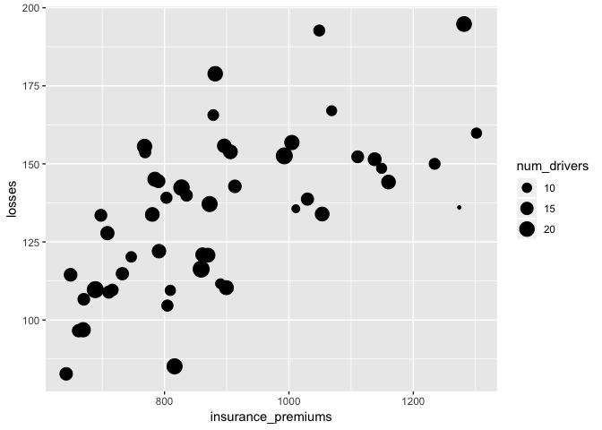
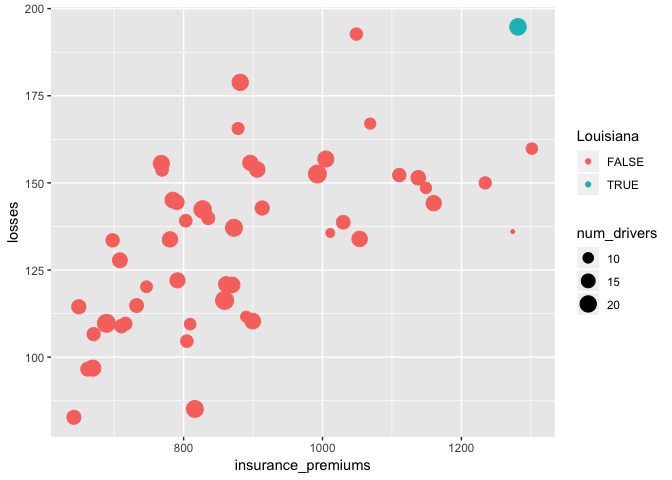
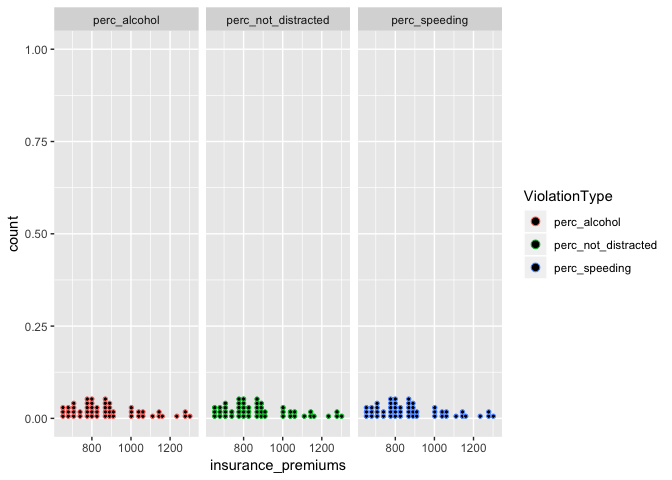

Assignment 3
================

For this assignment we are using a dataset from the website [Fivethirtyeight](http://fivethirtyeight.com/). All these datasets are available on their [GitHub page](https://github.com/fivethirtyeight/data/) and in the `fivethirtyeight` package.

1.  Install and load the `fivethirtyeight` library. For this assigment we are using the dataset `bad_drivers`.

2.  In the narrative, add a brief description (`?bad_drivers` for a description of the dataset) using *inline code* to show the variable names.

The bad drivers is a dataset that contains data the can say which state has the worst drivers; the dataset has variable namesstate, num\_drivers, perc\_speeding, perc\_alcohol, perc\_not\_distracted, perc\_no\_previous, insurance\_premiums, losses

1.  Plot a dot chart of premiums by losses. Map the count of drivers to the size of the dots. 

2.  Test what values from `state` are equal to "Louisiana" and assign the output to a new variable called \`Louisiana' (logical)

``` r
bad_drivers<- mutate(bad_drivers, Louisiana= state=="Louisiana")
```

1.  Map the variable "Louisiana" to `color`. That way, the dot referring to Louisiana should have a different color. 

2.  In your narrative, use inline code to report the average insurance premium and count of losses in US, and the premium and losses in Louisiana. Do not type those values manually, but extract them from the dataset using inline code.

``` r
USprem <- mean(bad_drivers$insurance_premiums/bad_drivers$losses)
LAprem <- mean( bad_drivers$insurance_premiums[bad_drivers$state== 'Louisiana']/bad_drivers$losses[bad_drivers$state=='Louisiana'])
```

The average number of insurance premium and count of losses in US is 6.670942 The average premium and losses in Louisiana is 6.5794743

1.  Report in a tabular format the 5 states with the highest premiums (include only state and insurance\_premiums)

``` r
HiPrem <- select(bad_drivers, state, insurance_premiums)
FiveHiPrem  <- arrange(HiPrem, desc(insurance_premiums))
top_n(FiveHiPrem, 5)
```

    ## Selecting by insurance_premiums

    ## # A tibble: 5 x 2
    ##   state                insurance_premiums
    ##   <chr>                             <dbl>
    ## 1 New Jersey                        1302.
    ## 2 Louisiana                         1282.
    ## 3 District of Columbia              1274.
    ## 4 New York                          1234.
    ## 5 Florida                           1160.

1.  Reshape the dataset gathering together perc\_speeding, perc\_alcohol, perc\_not\_distracted in one variable, paired with their pecentages. Name this variable "ViolationType" and the variable for the value pairs "perc".

``` r
bad_drivers <- gather(bad_drivers, key = "ViolationType",value = "perc", perc_speeding, perc_alcohol, perc_not_distracted) 
```

1.  Use facetting (DO NOT use 3 distinct calls to `ggplot()`) to plot 3 dot plots for the correlation between:

-   insurance\_premiums and perc\_alcohol
-   insurance\_premiums and perc\_speeding
-   insurance\_premiums and perc\_not\_distracted

<!-- -->

    ## `stat_bindot()` using `bins = 30`. Pick better value with `binwidth`.



1.  Mute the code for both charts and add a title to both. Knit to html.
