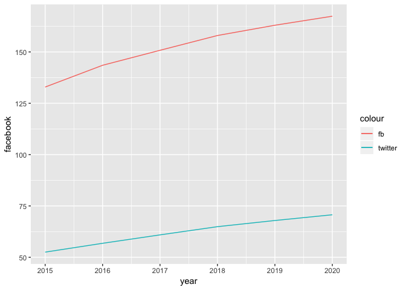

Lesson6: Tidy datasets for Dataviz"
================

Plotting in ggplot2 requires that you use so called [tidy datasets](http://r4ds.had.co.nz/tidy-data.html) (check [this article](http://vita.had.co.nz/papers/tidy-data.html) for a more in depth explanation). The requisites for a *tidy dataset* (also called *longitudinal* or *normal*) are:

1.  Each variable is in a column.
2.  Each observation is a row.
3.  Each value is a cell.

Most of the datasets that we have been dealing with so far are *tidy*: `beerDt`, `freqCasualties`, `twitter_users` (run these objects in the terminal to see how they look like). *Untidy datasets* are not necessarily "bad", but they are unsuitable for plotting in ggplot2.

For instance, look at `sn_users`

|  year|  twitter|  facebook|
|-----:|--------:|---------:|
|  2015|     52.5|     132.9|
|  2016|     56.8|     143.5|
|  2017|     60.9|     150.8|
|  2018|     64.9|     158.0|
|  2019|     67.9|     163.0|
|  2020|     70.7|     167.4|

What rules of the 3 mentioned above does `sn_users` violate? Would you still be able to plot a line chart of the number of users by year?

``` r
ggplot() +
  geom_line(aes(x  = year, y =  facebook, color='fb' ), data = sn_users) +
 geom_line(aes(x = year , y = twitter, color = "twitter"), data = sn_users)
```



To tidy `sn_users` we want (i) to collapse the millions of users under one variable (called for instance `Mil.Users`), and (ii) to turn the headers `twitter` and `facebook` into levels of a single variable (for instance called `socialNet`). In other words, we want to create key-value pairs, duplicating the column `year` as many time as needed to preserve the association between social network (e.g. twitter), and a number of users observed at a certain year. This is quite straightforward using the function `tidyr::gather()`:

``` r
gather(sn_users, key = 'socialNet', value = 'Mil.Users', twitter, facebook) 
```

    ##    year socialNet Mil.Users
    ## 1  2015   twitter      52.5
    ## 2  2016   twitter      56.8
    ## 3  2017   twitter      60.9
    ## 4  2018   twitter      64.9
    ## 5  2019   twitter      67.9
    ## 6  2020   twitter      70.7
    ## 7  2015  facebook     132.9
    ## 8  2016  facebook     143.5
    ## 9  2017  facebook     150.8
    ## 10 2018  facebook     158.0
    ## 11 2019  facebook     163.0
    ## 12 2020  facebook     167.4

``` r
#gather(sn_users, key = 'socialNet', value = 'Mil.Users', -year) #does the same as above: keeps everything BUT year
```

Use the output from the `gather()` above to plot a line chart including both twitter and facebook data.

``` r
# gather() %>% 
#ggpolot(...) +
#  geom_line(...)
```

Another example of untidy dataset is `untidyReview` (a dataset of online review ratings). Do you see why `untidyReview` is untidy? For instance, suppose we want to plot the distribution or ratings for each attributes (reviewOverall, reviewCleanliness, etc...) with `geom_bar()` and facets. How many/what variables to you need?

``` r
#gather()  use gather to 'tidy' the untidyReview
#pass the tidy dataset to ggplot() for plotting
```

Now inspect the dataset for `iphoneSales`, containing the number of iphones sold worldwide (in millions) in each quarter. Make sure you tidy the dataset appropriately to plot a line chart where:

-   each line represent the sales for a certain year
-   each quart is mapped to the horizontal axis
-   `NA` values are dropped (check `?gather()` for the parameters that drops `NA`)
-   not what you wanted? You might need to set `aes(group=...)`

``` r
# If you don't get the output you expect, inspect using str() or glimpse()
# Also, note that by default, the group is set to the interaction of all 
# discrete variables in the plot.

gather(iphoneSales, ... ) %>% 
  ggplot() +
  geom_line(aes(x= ..., y = ..., color = ...))
```

    ## Error in eval(lhs, parent, parent): '...' used in an incorrect context

However, sometimes you actually want to untidy datasets, for example to make them more readable. To 'untidy' a dataset, we can use `tidyr::spread()`. For instance, try to use `spread()` to untidy `socialNetwork_users`.

``` r
#spread() to untidy
#pass the output inside kable() to render a better looking table
#plot a line chart mapping the color to each social network name, years to the horizontal axis, and percent to the vertical axis
```

Exercise
========

Plot a barchart of the total sales for each model. First, tidy the dataset using `gather()`. Than use `geom_bar` to plot the total sales.

``` r
iphoneSales <- data.frame(
                  time = c("Sep 2014", "Sep 2015", "Sep 2016", "Dec 2016", "Sep 2017", "Dec 2017", "Jun 2018"), 
                  iPhone4S = c(9, NA, NA, NA, NA, NA, NA), 
                  iPhone5C = c(15.5, 5, NA, NA, NA, NA, NA), 
                  iPhone5S = c(30, 19, NA, NA, NA, NA, NA), 
                  iPhoneSE = c(NA, NA, 9.5, 6, 11, 7, 8), 
                  iPhone6 = c(33, 33, 5, NA, NA, NA, NA), 
                  iPhone6Plus = c(12.5, 19, 7, NA, NA, NA, NA), 
                  iPhone6S = c(NA, 16, 19, 11, 10, 6, 8), 
                  iPhone6SPlus = c(NA, 8, 12.5, 10, 4.5, 2, 3), 
                  iPhone7 = c(NA, NA, 31, 40, 28.5, 13, 16), 
                  iPhone7Plus = c(NA, NA, 16, 32.1, 29.5, 11, 11), 
                  iPhone8 = c(NA, NA, NA, NA, 6, 24, 13), 
                  iPhone8Plus = c(NA, NA, NA, NA, 10.5, 17, 24), 
                  iPhoneX = c(NA, NA, NA, NA, NA, 20.1, 17))
```
