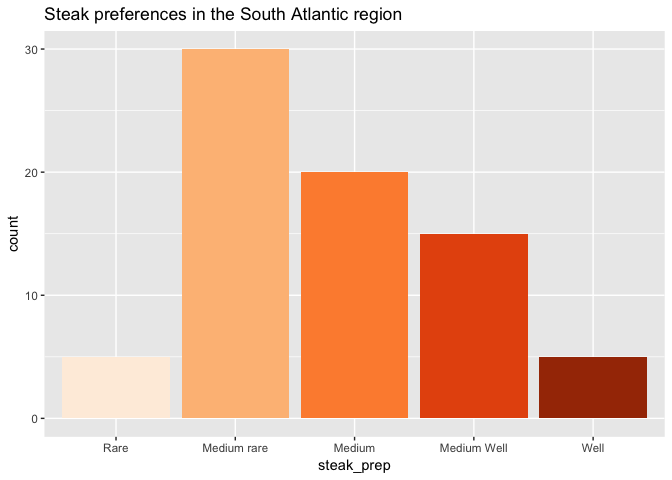

Parameterized Reports
================

Why is it useful to parametrize reports?
========================================

Suppose you want to produce individual regional reports for steak cooking preferences from `steak_survey`, which means 9 different reports. Using RMarkdown you can parametrize the variables of interest, that way you do not have to knit each reports manually.

For this example, the body of each report consists of a frequency table of behaviors (e.g., `smoke`, `gamble`) by education level and a bar chart of cooking preferences (`steak_prep`). In each report, we want to set two parameters:

1.  A logical value, for including/removing NA from the barchart of `steak_prep` preferences (i.e., individuals who do not eat steak at all).
2.  A character value, for the region of interest to use both as a title in each report and to select the relevant observations.

To start, think about the code you would write for a non-parametrized version of the report for a single region. Suppose the first report is about those subjects who eat steak (`steak==T`) in the `South Atlantic` region.

First, we subset the dataset

``` r
dt <- steak_survey %>% 
  filter(region == 'South Atlantic') 
```

Then, we can use the new dataset to render a frequency table of the behaviors:

``` r
dt %>% 
  gather(behavior, value, lottery_a:cheated) %>% 
  group_by(behavior) %>% summarise(tot = sum(value))
```

    ## # A tibble: 7 x 2
    ##   behavior    tot
    ##   <chr>     <int>
    ## 1 alcohol      66
    ## 2 cheated      17
    ## 3 gamble       46
    ## 4 lottery_a    38
    ## 5 skydiving     5
    ## 6 smoke        NA
    ## 7 speed        NA

And to plot a barchart

``` r
wantToDrop <- T
cls <- c(RColorBrewer::brewer.pal(5, 'Oranges'), "#4b4d51")
if (wantToDrop) {
  dt <- dt %>% drop_na(steak_prep) 
  cls <- c(RColorBrewer::brewer.pal(5, 'Oranges'))
           }
ggplot(dt) +
  geom_bar(aes(x = steak_prep), fill = cls ) +
  ggtitle(paste('Steak preferences in the South Atlantic region'))
```



How to parametrize reports?
===========================

The dynamic content of the regional report is a function of `steak` and `region`. We want to pass different values for `steak` and `region` as *parameters*, that we specify in yaml of each document using the attribute `params`. For instance:

    title: ""
    params:
      steak: 'T'
      region: 'South Atlantic'

Note that in the yaml **indentation matters**. The reason why we define parameters in the yaml instead of creating new objects is that it is easier to pass parameters functionally through the RMarkdown rendering function. For instance, we can generate a report for the region `Pacific` using:

``` r
rmarkdown::render(here::here('lectures', 'lesson16_paramReports', 'template.Rmd'), params = list(steak = 'F', region = 'Pacific'))
```

However, we do not want to pass the region names one by one manually. Instead, we can take a vector of the unique values for `region` from the `steak_survey` and programmatically use it to render the reports. Since each iteration saves a PDF of the knitted output, we want generate also each PDF file name functionally to avoid overwriting the same file at each iteration.

To apply a function to each element of a vector, use the function `map()`:

``` r
regions <- distinct(steak_survey, region) %>% drop_na()
map(.x = pull(regions), 
     ~ rmarkdown::render(here::here('lectures', 'lesson16_paramReports', 'template.Rmd'),
                                  params = list(steak = T, region = .x), 
                                  output_dir = here::here('lectures', 'lesson16_paramReports', 'report'),
                                  output_file = paste0(.x,'.pdf')))
```

Exercise
--------

Remember the map of alcohol consumption for beer, spirits, and wine? Create a parametrized report for each type of serving using parameters to render dynamically:

1.  The report title

2.  A world-map of alcohol consumption

3.  A narrative which includes the name of the country with the highest consumption for that particular serving type.

Use the `map_data("world")` and the dataset on [alcohol consumption in the world](https://github.com/fivethirtyeight/data/blob/master/alcohol-consumption)

``` r
dt <- read_csv('https://raw.githubusercontent.com/fivethirtyeight/data/master/alcohol-consumption/drinks.csv')
```
